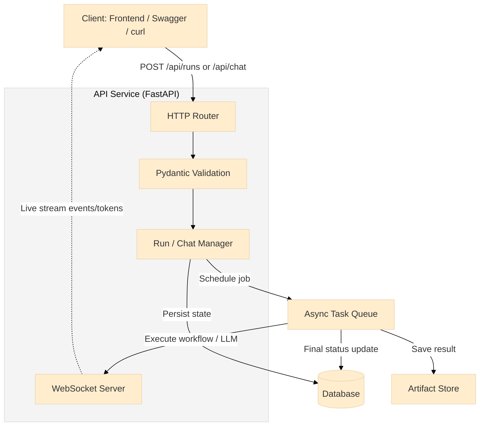

# LangGraph-FastAPI Server

<div align="center">


**A fully modular, production-ready FastAPI backend inspired by LangGraph server utilities**

*Provides asynchronous workflow execution, real-time streaming, persistent state, and a clean service-oriented architecture*

[Features](#features) • [Architecture](#architecture) • [Installation](#installation) • [Usage](#usage) • [API](#api-endpoints) • [Roadmap](#roadmap)

</div>

---

## Overview

This project implements a **LangGraph-style execution server** using FastAPI. It is designed as a backend foundation for:

* Agentic AI systems
* Graph-based workflows
* Stateful chat + streaming systems
* Async automation pipelines

The system separates concerns cleanly across API, orchestration, persistence, and streaming layers while remaining lightweight and extensible.

---

## Features

| Feature                  | Description                                 |
| ------------------------ | ------------------------------------------- |
| Async Workflow Execution | Background execution via asyncio task queue |
| Run Management           | Create, track, list, and update runs        |
| Persistent Artifacts     | JSON/file outputs saved per run             |
| Checkpointing            | Intermediate execution snapshots            |
| State Management         | Persisted workflow/chat state               |
| WebSocket Streaming      | Real-time status and token updates          |
| Chat Memory              | Threaded, stateful conversations            |
| Modular Architecture     | API → Services → Utils → Models             |

---

## Architecture

### High-Level System Architecture



---

### Workflow & Chat Execution Flow

```
USER ACTION
   │
   ▼
HTTP API (FastAPI)
   │
   ├─ Validate request (Pydantic)
   ├─ Persist state / message
   ├─ Enqueue async job
   │
   ▼
ASYNC TASK QUEUE
   │
   ├─ Execute workflow / LLM
   ├─ Save checkpoints & state
   ├─ Emit streaming events
   │
   ▼
WEBSOCKET STREAM
   │
   ├─ started
   ├─ token / node_update
   ├─ completed
   │
   ▼
FRONTEND UI
```

---

## Project Structure

```
langgraph-server/
├── app/
│   ├── main.py                    # FastAPI initialization + .env loader
│   ├── database.py                # Async DB setup (SQLite + aiosqlite)
│   ├── config.py                  # Configuration management
│   ├── auth.py                    # Authentication utilities
│   ├── init_db.py                 # Database initialization script
│   │
│   ├── api/
│   │   ├── main.py                # Router aggregator
│   │   ├── runs.py                # Run streaming endpoints
│   │   ├── stream.py              # WebSocket stream handler
│   │   └── endpoints/
│   │       └── chat.py            # Chat API (message history, send)
│   │
│   ├── models/
│   │   ├── run.py                 # Run workflow model
│   │   ├── chat.py                # Chat aggregate model
│   │   ├── chat_message.py        # Individual chat messages
│   │   ├── chat_thread.py         # Chat thread/conversation
│   │   └── user_model.py          # User authentication model
│   │
│   ├── schemas/
│   │   └── run.py                 # Pydantic validation models
│   │
│   ├── services/
│   │   ├── run_manager.py         # CRUD ops for runs
│   │   ├── workflow_service.py    # Main workflow logic
│   │   ├── chat_service.py        # Chat message processing + LLM streaming
│   │   ├── chat_memory.py         # Chat history persistence
│   │   ├── artifact_store.py      # Save result artifacts
│   │   ├── checkpoint_store.py    # Save execution checkpoints
│   │   └── state_services.py      # Maintain run state
│   │
│   ├── llm/
│   │   ├── base.py                # Base LLM interface
│   │   ├── mock.py                # Groq LLM implementation
│   │   └── provider.py            # LLM provider singleton
│   │
│   ├── utils/
│   │   ├── task_queue.py          # Async task queue
│   │   ├── stream_manager.py      # WebSocket connection manager
│   │   ├── logger.py              # Logging utilities
│   │   ├── db.py                  # Database utilities
│   │   └── redis_manager.py       # Redis connection manager
│   │
│   └── middleware/
│       ├── logging.py             # Request logging
│       └── rate_limit.py          # Rate limiting middleware
│
├── data/
│   ├── fastgraph.db               # SQLite database
│   ├── artifacts/                 # Final output files (JSON results)
│   ├── checkpoints/               # Execution snapshots
│   └── states/                    # State store
│
├── frontend/                      # React 19 dashboard (Vite + Tailwind)
│   ├── src/
│   │   ├── App.jsx                # Main chat interface
│   │   ├── App.css                # Custom styles
│   │   └── main.jsx               # React entry point
│   ├── package.json
│   └── vite.config.js
│
├── .env                           # Environment variables (API keys)
├── requirements.txt               # Python dependencies
├── test_run.py                    # Workflow test script
└── README.md
```

---

## Installation

### Backend Setup

```bash
git clone https://github.com/OrydleAI/Langgraph-FastAPI-Server.git
cd Langgraph-FastAPI-Server/langgraph-server

python -m venv venv
source venv/bin/activate  # Windows: venv\\Scripts\\activate

pip install -r requirements.txt
python -m app.init_db
uvicorn app.main:app --reload --port 8000
```

### Frontend Setup

```bash
cd frontend
npm install
npm run dev
```

---

## Usage

| Service      | URL                                                      |
| ------------ | -------------------------------------------------------- |
| Frontend UI  | [http://localhost:5173](http://localhost:5173)           |
| Swagger Docs | [http://localhost:8000/docs](http://localhost:8000/docs) |
| WebSocket    | ws://localhost:8000/api/ws/{thread_id}                   |

### Create a Workflow Run

```http
POST /api/runs/
{
  "name": "demo",
  "payload": { "input": "Hello" }
}
```

### Send Chat Message

```http
POST /api/chat/{thread_id}/message
{
  "message": "Hello agent"
}
```

---

## API Endpoints

| Method | Endpoint                      | Description         |
| ------ | ----------------------------- | ------------------- |
| POST   | /api/runs/                    | Create workflow run |
| GET    | /api/runs/                    | List runs           |
| POST   | /api/chat/{thread_id}/message | Send chat message   |
| GET    | /api/chat/{thread_id}/history | Chat history        |
| WS     | /api/ws/{thread_id}           | Streaming updates   |

---

## Tech Stack

**Backend**

* Python 3.12+
* FastAPI
* SQLAlchemy (Async)
* aiosqlite
* Pydantic v2
* asyncio + WebSockets

**Frontend**

* React 19
* Vite
* TailwindCSS

---

## Roadmap

* Async workflow execution (Completed)
* WebSocket streaming (Completed)
* Chat with LLM (Groq) (Completed)
* Persistent state & memory (Completed)
* Tool calling & function execution (In Progress)
* Multi-agent orchestration (In Progress)
* Token-level streaming UI improvements (In Progress)
* Persistent queues (Redis/Celery) (In Progress)
* Auth & API keys (In Progress)

---

## Author

**Rohit Ranjan Kumar**  
Contact: ranjanrohit908@gmail.com
GitHub: https://github.com/Rohit1x52

---

Made by [OrydleAI](https://github.com/OrydleAI)

</div>
